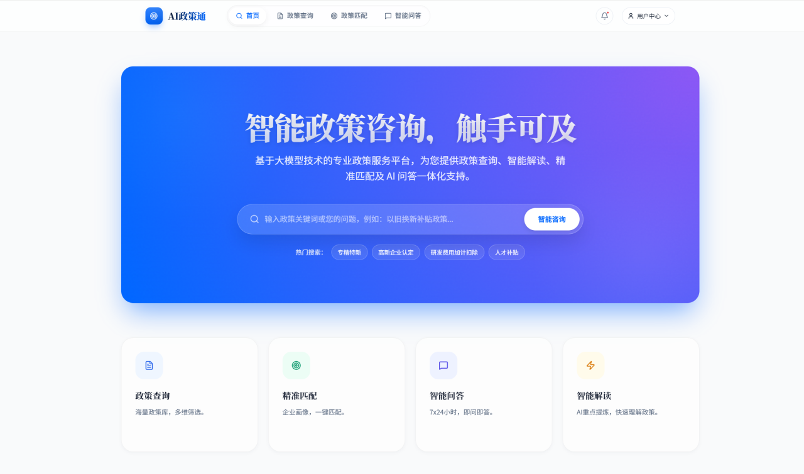

<div align="right">
  <a href="./README_EN.md">English</a> | 中文
</div>

<div align="center">
  
  <h1>AI 政策通·智能体服务平台</h1>
  <!-- <h3> 🏛️《山东省智能政策咨询助手》</h3> -->
  <h3 align="center">政策解读 | 补贴测算 | 多模态识别 | 管理员控制台</h3>
  <p><em>面向山东省政策场景，基于 RAG 技术构建的“全链路”智能知识库问答系统</em></p>

  
  
  
  <a href="https://github.com/Lvyizhuo/MyProject-SDAgent/issues">
    
  </a>
  <a href="https://github.com/Lvyizhuo/MyProject-SDAgent/blob/master/LICENSE">
    
  </a>

  <div align="center" style="margin-top: 15px;">
    
    
    
    
    
  </div>
</div>


## 项目简介

基于 AI/LLM 的山东省以旧换新政策咨询系统，支持政策问答、补贴计算、多模态识别，以及管理员控制台中的智能体配置、知识库管理和模型服务管理。

## 行业场景

面向政府部门、公共服务平台与行业协会的政策解读与咨询场景，聚焦山东省以旧换新相关政策的高频咨询需求。系统以“政策查询 + 补贴测算 + 多模态识别”为核心闭环，降低人工客服压力，提升政策触达与服务效率。

## 功能介绍

- 政策问答：基于 RAG 检索增强，提供结构化、可追溯的政策解答。
- 补贴测算：根据地区、品类、价格等因素计算补贴金额。
- 多模态识别：支持语音转写、图片/设备/发票识别。
- 管理员控制台：统一维护智能体配置、知识库与模型服务。
- 安全与治理：鉴权、工具调用意图校验、失败兜底策略与日志审计。

## 项目实现

整体采用前后端分离架构，前端负责多场景交互与管理控制台，后端负责对话编排、知识检索、模型路由与多模态能力集成；通过统一的工具意图分类与失败策略中心，实现可控、可追踪的智能体能力输出。

## 技术架构

| 层级 | 技术栈 |
|------|--------|
| 前端 | React 19 + Vite 7 |
| 后端 | Spring Boot 3.4.1 + Spring AI 1.0.3 |
| 大模型 | 阿里云 DashScope（聊天默认 `qwen3.5-plus`，支持管理员绑定第三方 OpenAI 兼容模型） |
| 向量数据库 | PostgreSQL 16 + pgvector |
| 缓存/会话 | Redis 7 |
| 对象存储 | MinIO |
| 鉴权 | Spring Security + JWT |

## 项目结构

```text
├── backend/
│   ├── src/main/java/com/shandong/policyagent/
│   │   ├── advisor/       # 安全、记忆、日志、重读校验
│   │   ├── agent/         # ToolIntentClassifier / AgentPlanParser
│   │   ├── config/        # ChatClient/Security/Embedding/Minio 配置
│   │   ├── controller/    # Chat/Auth/Admin/Knowledge/Model/PublicConfig API
│   │   ├── entity/        # JPA 实体（含 AgentConfig / ModelProvider / ModelType）
│   │   ├── multimodal/    # ASR 与视觉
│   │   ├── rag/           # 知识库切片、检索、向量写入、运行时嵌入模型路由
│   │   ├── service/       # 业务逻辑（含动态模型与密钥加解密）
│   │   └── tool/          # calculateSubsidy / parseFile / webSearch
│   ├── src/main/resources/
│   ├── docker-compose.yml # PostgreSQL + Redis + MinIO
│   └── pom.xml
├── frontend/
│   ├── src/
│   │   ├── pages/         # 含 AdminConsolePage
│   │   ├── components/    # 含 admin/ 子模块
│   │   └── services/      # api / adminApi / adminKnowledgeApi
│   └── package.json
├── data/
└── docs/
```

## 快速开始

### 环境要求

- Java 21+
- Node.js 18+
- Docker & Docker Compose

### 1. 设置环境变量

```bash
export DASHSCOPE_API_KEY=your_dashscope_api_key
export TAVILY_API_KEY=your_tavily_api_key   # 可选，联网搜索工具
export APP_JWT_SECRET=your_base64_jwt_secret
export APP_MODEL_PROVIDER_ENCRYPTION_SECRET=your_model_provider_secret   # 可选但推荐，启用模型管理时建议配置
```

### 2. 启动基础设施

```bash
cd backend
docker compose up -d
```

### 3. 启动后端

```bash
cd backend
./mvnw spring-boot:run

# mcp profile
./mvnw spring-boot:run -Dspring-boot.run.profiles=mcp
```

### 4. 启动前端

```bash
cd frontend
npm install
npm run dev
```

## 服务器部署（宝塔 + Docker Compose）

推荐在 Linux 服务器使用 `deploy/` 目录一键部署（包含前后端 + PostgreSQL + Redis + MinIO + Ollama）。

### 1. 准备部署配置

```bash
cd /www/wwwroot/MyProject-SDAgent
cp deploy/.env.example deploy/.env
vi deploy/.env
```

至少需要正确配置：
- `DASHSCOPE_API_KEY`
- `APP_JWT_SECRET`
- `APP_MODEL_PROVIDER_ENCRYPTION_SECRET`（可选但推荐：模型管理 API Key 加密主密钥）
- `POSTGRES_PASSWORD`
- `MINIO_PASSWORD`
- `APP_SECURITY_CORS_ALLOWED_ORIGIN_PATTERNS`
- `APP_EMBEDDING_OLLAMA_BASE_URL`（容器内默认 `http://ollama:11434`）

建议先生成密钥再写入 `.env`：

```bash
openssl rand -base64 48
```

注意：
- 不要保留示例占位符（如 `replace-with-base64-secret`、`replace-with-strong-password`）。
- `APP_JWT_SECRET` 必须是标准 Base64 字符串，否则管理员登录会出现 `Illegal base64 character`。
- 修改 `.env` 后，至少要重建 `backend` 容器让新环境变量生效。

## 管理员控制台

当前管理员控制台包含 4 个主模块：

- 智能体：配置系统提示词、开场白、技能开关，并可绑定大语言/视觉/语音/嵌入模型
- 知识库：管理文件夹、上传文档/网站导入、批量移动/删除、查看切片结果、重新入库、归档导出/导入
- 工具：展示统一工具治理的信息架构与后续接入方向
- 模型：维护 LLM、视觉、语音、嵌入、重排序五类模型，支持新增、编辑、删除、设为默认、连接测试

智能体测试面板会展示“当前生效模型”，区分是来自模型管理绑定还是手动配置。

### 2. 启动容器

```bash
cd /www/wwwroot/MyProject-SDAgent/deploy
./deploy.sh
```

### 3. 健康检查

```bash
curl -f http://127.0.0.1:8080/actuator/health
curl -f http://127.0.0.1:8080/api/chat/health
curl -f http://127.0.0.1:5173/health
```

### 4. 宝塔 Nginx 反向代理要点

推荐按以下顺序配置（以域名 `mmgg.dpdns.org` 为例）：

1) 域名解析
- 在 DNS 服务商（如 Cloudflare）添加 A 记录：`mmgg.dpdns.org -> 你的服务器公网 IP`。

2) 服务器放行端口
- 放行 `22/80/443`；无需对公网放行 `8080/5173`（容器已绑定 `127.0.0.1`）。

3) 宝塔创建 Docker 网站
- 入口：`宝塔面板 -> Docker -> 网站 -> 创建`。
- 选择：`反代容器`（不要选“运行环境/从应用创建”）。
- 域名：`mmgg.dpdns.org`。
- 容器：`policy-agent-frontend`。
- 端口：优先选容器端口 `80`（若面板仅展示映射端口则选 `5173`）。

4) 在宝塔“配置文件 -> 自定义配置文件（server块）”补充后端路由
- 不要写 `server {}`。
- 如果已有 `location /`，不要重复新增。

```nginx
location /api/ {
    proxy_pass http://127.0.0.1:8080/api/;
    proxy_http_version 1.1;
    proxy_set_header Connection "";
    proxy_set_header Host $host;
    proxy_set_header X-Real-IP $remote_addr;
    proxy_set_header X-Forwarded-For $proxy_add_x_forwarded_for;
    proxy_set_header X-Forwarded-Proto $scheme;
    proxy_buffering off;
    proxy_cache off;
    proxy_read_timeout 600s;
    proxy_send_timeout 600s;
}

location /actuator/ {
    proxy_pass http://127.0.0.1:8080/actuator/;
    proxy_http_version 1.1;
    proxy_set_header Host $host;
}
```

5) 检查并重载 Nginx

```bash
nginx -t && nginx -s reload
```

6) 验证

```bash
curl -f http://mmgg.dpdns.org/health
curl -f http://mmgg.dpdns.org/actuator/health
curl -f http://mmgg.dpdns.org/api/chat/health
```

## 生产更新

### 更新

```bash
cd /www/wwwroot/MyProject-SDAgent
git pull
cd deploy
./deploy.sh
```


## 常见排障

- 查看后端日志：`docker compose logs -f backend`
- 查看最近错误：`docker compose logs --tail=200 backend`
- 查看容器状态：`docker compose ps`
- 查看后端健康状态：`docker inspect -f '{{.State.Health.Status}}' policy-agent-backend`
- 若知识库模型列表为空或上传失败，先检查 `backend` 日志是否有 `EmbeddingService` 相关报错，再核对 `APP_EMBEDDING_OLLAMA_BASE_URL`。
- 若管理员登录时报 `Illegal base64 character`：检查 `.env` 中 `APP_JWT_SECRET` 是否仍是占位符或非标准 Base64，修正后执行 `docker compose up -d --force-recreate backend`。

## 访问地址

| 服务 | 地址 |
|------|------|
| 前端 | http://localhost:5173 |
| 后端 API | http://localhost:8080 |
| 健康检查 | http://localhost:8080/api/chat/health |
| MinIO API | http://localhost:9000 |
| MinIO Console | http://localhost:9001 |

## API 概览

### 对话与文档

| 方法 | 路径 | 描述 |
|------|------|------|
| POST | `/api/chat` | 标准对话 |
| POST | `/api/chat/stream` | 流式对话（SSE） |
| GET | `/api/chat/health` | 健康检查 |
| POST | `/api/documents/load` | 加载默认文档 |
| POST | `/api/documents/load-directory` | 加载指定目录文档 |
| DELETE | `/api/documents` | 删除文档向量（`ids=...`） |

### 用户认证与会话

| 方法 | 路径 | 描述 |
|------|------|------|
| POST | `/api/auth/register` | 用户注册 |
| POST | `/api/auth/login` | 用户登录 |
| GET | `/api/auth/me` | 当前用户信息 |
| GET | `/api/conversations` | 当前用户会话列表 |
| GET | `/api/conversations/{sessionId}` | 获取/创建指定会话 |
| DELETE | `/api/conversations/{sessionId}` | 删除会话 |

### 管理员配置与知识库

| 方法 | 路径 | 描述 |
|------|------|------|
| POST | `/api/admin/auth/login` | 管理员登录 |
| POST | `/api/admin/auth/change-password` | 修改管理员密码 |
| GET | `/api/admin/agent-config` | 获取智能体配置 |
| PUT | `/api/admin/agent-config` | 更新智能体配置 |
| POST | `/api/admin/agent-config/reset` | 重置智能体配置 |
| POST | `/api/admin/agent-config/test` | 管理员测试对话 |
| GET | `/api/admin/models` | 获取模型列表 |
| GET | `/api/admin/models/{id}` | 获取模型详情 |
| POST | `/api/admin/models` | 新增模型 |
| PUT | `/api/admin/models/{id}` | 更新模型 |
| DELETE | `/api/admin/models/{id}` | 删除模型 |
| PUT | `/api/admin/models/{id}/set-default` | 设为默认模型 |
| POST | `/api/admin/models/{id}/test` | 测试模型连接 |
| GET | `/api/admin/models/options` | 获取模型下拉选项 |
| GET | `/api/admin/knowledge/folders` | 获取知识库目录树 |
| POST | `/api/admin/knowledge/folders` | 创建知识库文件夹 |
| PUT | `/api/admin/knowledge/folders/{id}` | 更新知识库文件夹 |
| DELETE | `/api/admin/knowledge/folders/{id}` | 删除知识库文件夹 |
| POST | `/api/admin/knowledge/documents` | 上传知识文档 |
| POST | `/api/admin/knowledge/documents/extract-metadata` | 智能提取文档元数据 |
| GET | `/api/admin/knowledge/documents` | 分页查询文档 |
| GET | `/api/admin/knowledge/documents/selection` | 获取当前筛选范围文档 id 列表 |
| GET | `/api/admin/knowledge/documents/{id}` | 获取文档详情 |
| GET | `/api/admin/knowledge/documents/{id}/chunks` | 查询文档切片结果 |
| GET | `/api/admin/knowledge/documents/{id}/download` | 下载原始文档 |
| GET | `/api/admin/knowledge/documents/{id}/preview` | 获取预览地址（MinIO 或外部链接） |
| DELETE | `/api/admin/knowledge/documents/{id}` | 删除文档 |
| POST | `/api/admin/knowledge/documents/{id}/reingest` | 重新入库文档 |
| POST | `/api/admin/knowledge/documents/batch-delete` | 批量删除文档 |
| POST | `/api/admin/knowledge/documents/batch-move` | 批量移动文档 |
| GET | `/api/admin/knowledge/archive/export` | 导出知识库归档 |
| POST | `/api/admin/knowledge/archive/import` | 导入知识库归档 |
| GET | `/api/admin/knowledge/embedding-models` | 获取可用嵌入模型 |
| GET | `/api/admin/knowledge/config` | 获取知识库配置 |
| PUT | `/api/admin/knowledge/config` | 更新知识库配置 |
| POST | `/api/admin/knowledge/url-imports` | 创建网站导入任务 |
| GET | `/api/admin/knowledge/url-imports` | 查询网站导入任务与待处理条目 |
| GET | `/api/admin/knowledge/url-imports/{id}` | 获取待入库内容详情 |
| POST | `/api/admin/knowledge/url-imports/{id}/confirm` | 确认入库（生成文档并切片） |
| POST | `/api/admin/knowledge/url-imports/batch-confirm` | 批量确认入库 |
| POST | `/api/admin/knowledge/url-imports/{id}/reject` | 驳回待入库内容 |
| POST | `/api/admin/knowledge/url-imports/{id}/cancel` | 取消网站导入任务 |
| DELETE | `/api/admin/knowledge/url-imports/{id}` | 删除网站导入任务 |
| DELETE | `/api/admin/knowledge/url-import-items/{id}` | 删除待入库内容 |
| GET | `/api/public/config/agent` | 获取公开智能体配置（当前包含开场白） |

### 多模态

| 方法 | 路径 | 描述 |
|------|------|------|
| POST | `/api/multimodal/transcribe` | 语音识别 |
| POST | `/api/multimodal/analyze-image` | 图像分析 |
| POST | `/api/multimodal/analyze-invoice` | 发票识别 |
| POST | `/api/multimodal/analyze-device` | 设备识别 |

## 常用命令

```bash
# backend
cd backend
./mvnw clean package
./mvnw test
./mvnw spring-boot:run

# frontend
cd frontend
npm run dev
npm run build
npm run lint
```

## 运行时说明

- `DynamicChatClientFactory` 会优先使用管理员绑定的大语言模型；未绑定时回退到手动配置。
- `RuntimeRagVectorStore` 会优先使用管理员绑定的嵌入模型；未绑定时回退到知识库默认嵌入模型。
- `DocumentLoaderService` 在扫描版 PDF 提取不到正文时，会尝试走视觉 OCR 兜底。
- `ChatService` 对实时查询会优先执行 `webSearch`，并在部分模型超时或 OpenAI 兼容调用异常时尝试降级。

## 默认端口

| 服务 | 端口 |
|------|------|
| 前端 | 5173 |
| 后端 | 8080 |
| PostgreSQL | 5432 |
| Redis | 6379 |
| MinIO API | 9000 |
| MinIO Console | 9001 |

## ⭐ Star History


<p align="center">
  <a href="https://star-history.com/#Lvyizhuo/MyProject-SDAgent&Date">
    
  </a>
</p>

> 如果这个项目对你有帮助，欢迎点个 Star⭐；也欢迎提交 Issue 或 PR，一起把山东省政策智能体做得更实用。