# 多级缓存 · RAG系统 · 上下文管理 · 记忆与多轮对话

> 本文档从架构视角剖析系统的四大核心基础设施机制，涵盖缓存分层、RAG 检索增强、上下文注入管线以及多轮对话的记忆持久化。

---

## 目录

1. [多级缓存机制](#1-多级缓存机制)
2. [RAG 检索增强系统](#2-rag-检索增强系统)
3. [Agent 上下文管理](#3-agent-上下文管理)
4. [记忆与多轮对话](#4-记忆与多轮对话)
5. [源码索引](#5-源码索引)

---

## 1. 多级缓存机制

### 1.1 全局缓存架构

系统实现 6 个独立的 Redis 缓存子系统，全部手写 Redis 操作（未使用 Spring `@Cacheable`），覆盖问答、价格、事实、搜索、对话、会话六个维度：

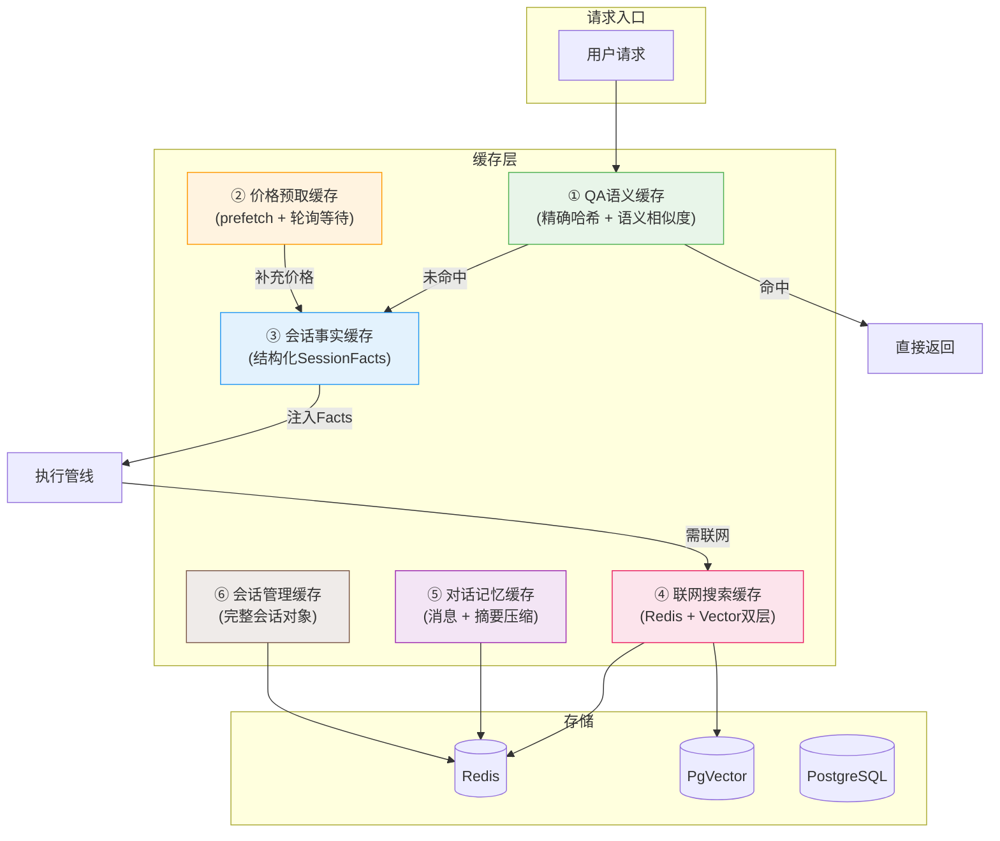

### 1.2 QA 语义缓存 — `QuestionSemanticCacheService`

采用**两级查找**架构：先精确哈希匹配，未命中时走语义相似度查找。

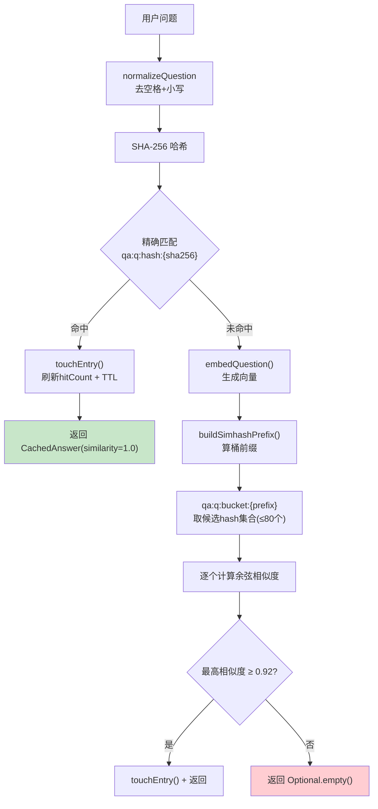

**三组 Redis Key 结构**：

| Key 前缀 | 数据结构 | 用途 |
|---|---|---|
| `qa:q:hash:{sha256Hex}` | String (JSON) | 主缓存条目，存储问答对及向量 |
| `qa:q:bucket:{simhashPrefix}` | Set | Simhash 桶，存储同桶内的 questionHash |
| `qa:q:meta:{sha256Hex}` | Hash | 元数据：updatedAt、hitCount、ttlMinutes |

**配置参数**：

| 参数 | 默认值 | 说明 |
|---|---|---|
| `app.qa-cache.enabled` | true | 总开关 |
| `app.qa-cache.ttl-minutes` | 1440 (24h) | TTL，滑动过期 |
| `app.qa-cache.semantic-threshold` | 0.92 | 语义相似度阈值 |
| `app.qa-cache.bucket-prefix-bits` | 14 | Simhash 桶前缀位数 |

**智能排除**：`shouldUseQaSemanticCache()` 对含"最新""实时""价格""政策"等时效性关键词的问题**禁用缓存**。

### 1.3 商品价格缓存 — `ProductPriceCacheService`

采用**预取 + 轮询等待**模式，实现价格信息的准实时注入：

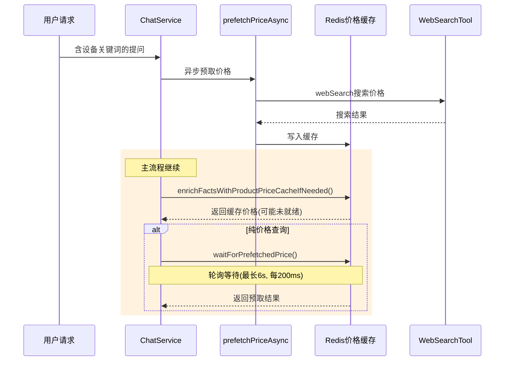

**Key 生成策略**（`buildLookupKeys`，按优先级排列）：

| 优先级 | Key 模式 | 示例 |
|---|---|---|
| 高 | `chat:price-cache:model:{model}:category:{category}` | `model:iphone-17-pro:category:手机` |
| 中 | `chat:price-cache:model:{model}` | `model:iphone-17-pro` |
| 低 | `chat:price-cache:category:{category}` | `category:手机` |

Key 归一化：去空格、小写、空格变 `-`、去除非中文/非字母数字/非 `-` 的字符。TTL: 1440 分钟，**非滑动**过期。

### 1.4 联网搜索缓存 — `WebSearchTool`

**最复杂的缓存设计**，采用 Redis + VectorStore 双层缓存，支持 stale-while-revalidate 和 singleflight：

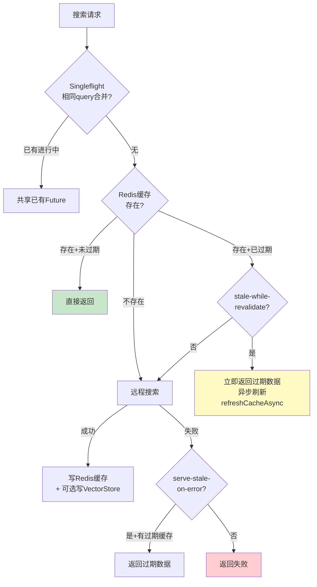

**关键特性**：

| 特性 | 配置项 | 说明 |
|---|---|---|
| 逻辑过期 | `app.websearch.cache.ttl-minutes=120` | 由 `cachedAt + TTL` 判断，非 Redis TTL |
| Stale-while-revalidate | `stale-while-revalidate=true` | 过期数据立即返回，后台异步刷新 |
| Serve-stale-on-error | `serve-stale-on-error=true` | 远程失败时返回过期缓存 |
| Singleflight | `singleflight-enabled=true` | `ConcurrentHashMap<Query, Future>` 合并并发请求 |
| 向量缓存 | `cache-to-vectorstore=true` | 搜索结果异步写入 VectorStore |

### 1.5 缓存键命名空间总览

| 命名空间 | 服务 | TTL | 过期策略 |
|---|---|---|---|
| `qa:q:hash/bucket/meta:*` | QuestionSemanticCacheService | 24h | 滑动（命中刷新） |
| `chat:price-cache:*` | ProductPriceCacheService | 24h | 固定（不刷新） |
| `chat:facts:*` | SessionFactCacheService | 7 天 | 滑动 |
| `chat:memory:*` | RedisChatMemory | 7 天 | 滑动 |
| `chat:memory:summary:*` | RedisChatMemory | 7 天 | 滑动 |
| `tool:websearch:cache:*` | WebSearchTool | 120min | 逻辑过期 |
| `chat:session:*` | ConversationService | 30 天 | 滑动 |
| `user:sessions:*` | ConversationService | 30 天 | 滑动 |

### 1.6 缓存架构关键特征

1. **异步写入优先**：QA 缓存、价格缓存、向量缓存均使用 `CompletableFuture.runAsync()` 异步写入，不阻塞主请求
2. **分层缓存**：WebSearchTool 采用 Redis + VectorStore 双层；QuestionSemanticCacheService 采用精确哈希 + 语义向量两级
3. **逻辑过期 vs Redis TTL**：WebSearchTool 使用逻辑过期实现 stale-while-revalidate；其他服务使用 Redis 原生 TTL
4. **预取 + 轮询等待**：价格查询场景支持异步预取 + 主线程轮询等待（最长 6s），实现准实时注入
5. **智能缓存排除**：时效性问题（含"最新""实时"等关键词）自动跳过 QA 语义缓存

---

## 2. RAG 检索增强系统

### 2.1 全局架构

RAG 系统分为**入库管线**和**检索管线**两条独立的数据流：

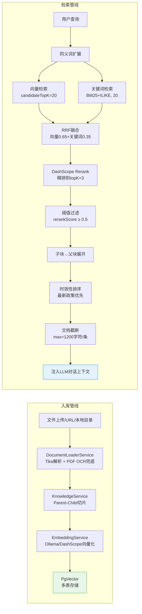

### 2.2 入库管线详解

#### 2.2.1 文档加载 — `DocumentLoaderService`

| 能力 | 说明 |
|---|---|
| 支持格式 | `.pdf`, `.doc`, `.docx`, `.md`, `.txt` |
| 解析引擎 | Apache Tika（`TikaDocumentReader`） |
| PDF OCR 兜底 | Tika 提取不出文本时，`pdftoppm` 转图片 → `VisionService` 多模态 OCR，最多 12 页 |
| 爬虫数据 | 从 `policies.json` 加载预爬取的政策数据 |

#### 2.2.2 切片策略 — Parent-Child 双层切片

传统单层切片的困境：切太细则丢失上下文，切太粗则检索精度低。本项目采用**检索细粒度、返回粗粒度**的双层方案：

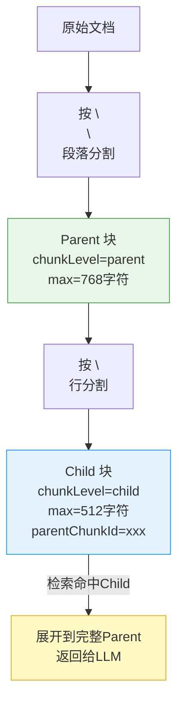

**遗留管线切片参数**（`TextSplitterService`，使用 `PARAGRAPH_CHAR_V2` 策略）：

| 参数 | 配置值 | 说明 |
|---|---|---|
| `defaultChunkSize` | 900 | 目标切片大小（字符数） |
| `chunkOverlap` | 150 | 重叠字符数 |
| `minChunkSizeChars` | 250 | 最小切片大小 |
| `noSplitMaxChars` | 900 | 短文档直入阈值 |

切片流程：文本规范化 → 按双换行分段 → 超长段落按句子边界分割 → 段落装配（累积至目标大小） → 微小块合并 → 重叠应用 → 硬限制保护。

**自适应切片**：根据嵌入模型的 `maxInputChars` 安全阈值自动收敛切片参数，确保切片不超出模型输入限制。

#### 2.2.3 嵌入模型 — 双模型架构

| 模型 ID | 提供者 | 维度 | 向量表 | 最大输入 |
|---|---|---|---|---|
| `ollama:nomic-embed-text` | Ollama (本地) | 768 | `vector_store_ollama_nomic_768` | 900 字符 |
| `dashscope:text-embedding-v3` | DashScope (云端) | 1024 | `vector_store_dashscope_v3` | 6000 字符 |

**动态模型路由**（`EmbeddingService`）：优先使用请求指定的模型 → 配置的默认模型 → 内置默认（`ollama:nomic-embed-text`）→ 第一个可用模型。同时支持将外部 `ModelProvider` 的 modelName/apiUrl 映射到系统内部嵌入模型 ID。

#### 2.2.4 向量存储 — 多表架构

`MultiVectorStoreService` 为每个嵌入模型维护独立的 PgVector 表：

```sql
CREATE TABLE {tableName} (
    id UUID PRIMARY KEY,
    content TEXT,
    metadata JSONB,           -- folderId, chunkLevel, parentChunkId, source 等
    embedding vector({dimensions})
);
-- 维度 ≤ 2000 时自动创建 HNSW 索引 (vector_cosine_ops)
```

**入库调度**（`KnowledgeIngestScheduler`）：定时轮询 PENDING 状态文档（每 2 秒），Semaphore 控制并发（最大 2），令牌桶限流（每分钟 30 次），CAS 状态抢占防止重复处理。

**增量状态**（`IngestionStateService`）：通过 SHA-256 指纹（`source + text`）跟踪已入库文档，避免重复入库。

### 2.3 检索管线详解

#### 2.3.1 混合检索 + RRF 融合

`RagRetrievalService.retrieveRelevantDocuments()` 完整流程：

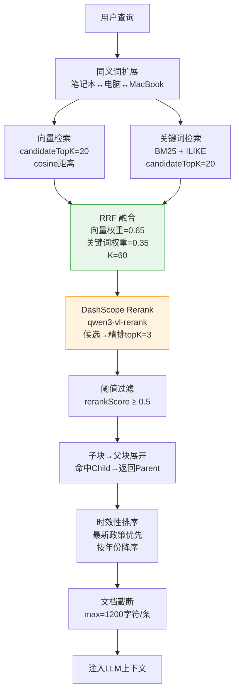

#### 2.3.2 RRF 融合公式

```
rrfScore(doc) = VECTOR_WEIGHT / (K + vectorRank + 1)
              + KEYWORD_WEIGHT / (K + keywordRank + 1)

VECTOR_WEIGHT = 0.65    // 向量语义检索权重
KEYWORD_WEIGHT = 0.35   // 关键词检索权重
K = 60                   // 标准RRF常数
```

对同一文档在两路检索中的 RRF 分数求和，按融合分数降序排列。

#### 2.3.3 关键词检索（BM25 + ILIKE）

```sql
-- PostgreSQL 全文检索
SELECT *, ts_rank_cd(to_tsvector('simple', content),
       plainto_tsquery('simple', :query)) AS score
FROM {table}
WHERE to_tsvector('simple', content) @@ plainto_tsquery('simple', :query)
   OR content ILIKE '%' || :query || '%'   -- 模糊匹配兜底
ORDER BY score DESC
```

支持知识库目录范围过滤（`folderId`）和块级别过滤（`chunkLevel`）。

#### 2.3.4 重排序 — `DashScopeRerankService`

| 参数 | 值 | 说明 |
|---|---|---|
| `rerankModel` | qwen3-vl-rerank | 重排模型 |
| `rerankMaxDocChars` | 3000 | 单条文档最大字符 |
| `rerankEnabled` | true | 是否启用 |

**运行时解析**：优先使用知识库绑定的重排模型 → 回退到系统配置的重排模型。

**容错机制**：404 时自动切换备用 endpoint（`/compatible-mode/` → `/api/`）；任何异常回退为纯向量检索结果。

`RerankingVectorStore` 使用**装饰器模式**包装底层 VectorStore：先扩大召回（candidateTopK=20），再调用 rerank 精排到 topK=3。

#### 2.3.5 时效性排序

`preferLatestPolicyDocuments`：从元数据提取年份（`publishYear`/`year`/`publishDate`/`title`），按年份降序 + 分数降序排列，确保最新政策优先展示。

### 2.4 RAG 故障检测与降级

`RagFailureDetector` 识别可恢复的 RAG 异常（嵌入模型 OOM、上下文超长、向量存储故障等），允许系统在 RAG 不可用时降级为纯 LLM 对话。`ChatService` 中 `enableRag` 参数由执行计划的 `toolHint` 动态控制。

---

## 3. Agent 上下文管理

### 3.1 五层上下文注入架构

上下文分为 5 层，由 Advisor 链和 ChatService 逐层注入到 LLM 的 prompt 中：

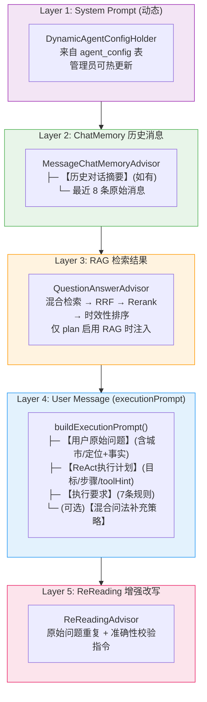

### 3.2 Advisor 链执行顺序

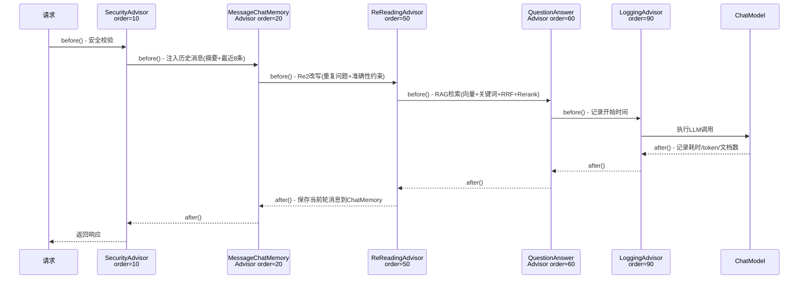

| Order | Advisor | 角色 | 修改上下文 |
|---|---|---|---|
| 10 | SecurityAdvisor | 安全审查 | 不修改，拒绝不安全请求 |
| ~20 | MessageChatMemoryAdvisor | 记忆注入 | 注入摘要+历史消息；保存当前轮 |
| 50 | ReReadingAdvisor | 准确性增强 | 重复问题+追加准确性校验指令 |
| ~60 | QuestionAnswerAdvisor | RAG检索 | 注入检索到的政策文档 |
| 90 | LoggingAdvisor | 日志记录 | 不修改，记录耗时/token |

### 3.3 系统提示词 — 运行时热更新

`DynamicAgentConfigHolder` 以 `AtomicReference<AgentConfig>` 持有系统提示词：

- 启动时从 `agent_config` 表加载
- 管理员修改后通过 `AgentConfigSyncService.update()` 热更新
- 每次请求 `.system(dynamicAgentConfigHolder.getSystemPrompt())` 动态注入
- **无需重启服务即可生效**

### 3.4 用户消息构建 — `buildUserMessage()`

将原始问题、城市/定位上下文、事实缓存组装为完整的用户消息：

```
{原始用户问题}

【用户城市上下文】cityCode=370100
【用户定位上下文】lat=36.65, lng=117.12, accuracy=50m
【会话事实缓存】
- 设备型号：iPhone 16 Pro
- 品牌：苹果
- 商品类别：手机
- 最近提及金额：8999.0元
- 地区线索：济南市
- 当前诉求：补贴测算
- 待补充信息：购买价格
```

### 3.5 规划器上下文 — `buildPlannerMessage()`

为规划器使用**紧凑格式**，节省 token：

```
【用户当前问题】
iPhone 16 Pro 能补贴多少？

【会话结构化摘要】
年份=2025 | 品类=手机 | 品牌=苹果 | 价格=8999元 | 诉求=补贴测算

【规划提示】
请优先依据结构化摘要理解上下文，再判断是否需要 ReAct 工具调用。
```

### 3.6 执行 Prompt — `buildExecutionPrompt()`

合并用户消息和执行计划：

```
【用户原始问题】
{buildUserMessage 的完整输出}

【ReAct执行计划（由系统规划）】
目标：计算 iPhone 16 Pro 的以旧换新补贴
需要工具：true
步骤：
1. 收集并校验补贴计算所需参数 [toolHint=calculateSubsidy]
2. 调用 calculateSubsidy 输出补贴金额和说明 [toolHint=calculateSubsidy]

【执行要求】
1. 严格按计划执行...
7. 若问题明确包含最新/实时...应调用 webSearch 并给出来源链接。
```

### 3.7 ReReading 增强改写 — `ReReadingAdvisor`

实现 Re2 (Re-Reading) 提示技术，在用户问题末尾追加准确性约束：

```
{原始问题}

请在回答前仔细核对以下要求：
1. 如果涉及具体金额、日期、比例等数字，请确保与检索到的政策文档一致
2. 如果检索到的文档中没有相关信息，请明确告知用户"根据现有政策文档未找到相关信息"
3. 不要编造或猜测政策内容

请再次阅读用户问题，确保回答准确：{原始问题}
```

### 3.8 上下文窗口控制策略

| 策略 | 参数 | 目的 |
|---|---|---|
| 消息数量限制 | 最多 8 条 | 防止上下文过长 |
| 单条消息截断 | 最大 1500 字符 | 控制单条消息体积 |
| 异步摘要压缩 | ≥6 条触发，保留最近 2 条 | 压缩旧消息为 1200 字符摘要 |
| 事实缓存替代 | SessionFacts 持久化 | 即使消息被截断/摘要，关键信息仍保留 |
| 规划器上下文精简 | `key=value \| key=value` | 节省规划 token |
| RAG 文档截断 | 1200 字符/条 | 防止检索结果溢出 |
| 候选扩大+精排 | candidate=20 → topK=3 | 先大后小，保证召回率 |

### 3.9 动态 ChatClient — `DynamicChatClientFactory`

根据执行计划动态控制工具和 RAG 的启用：

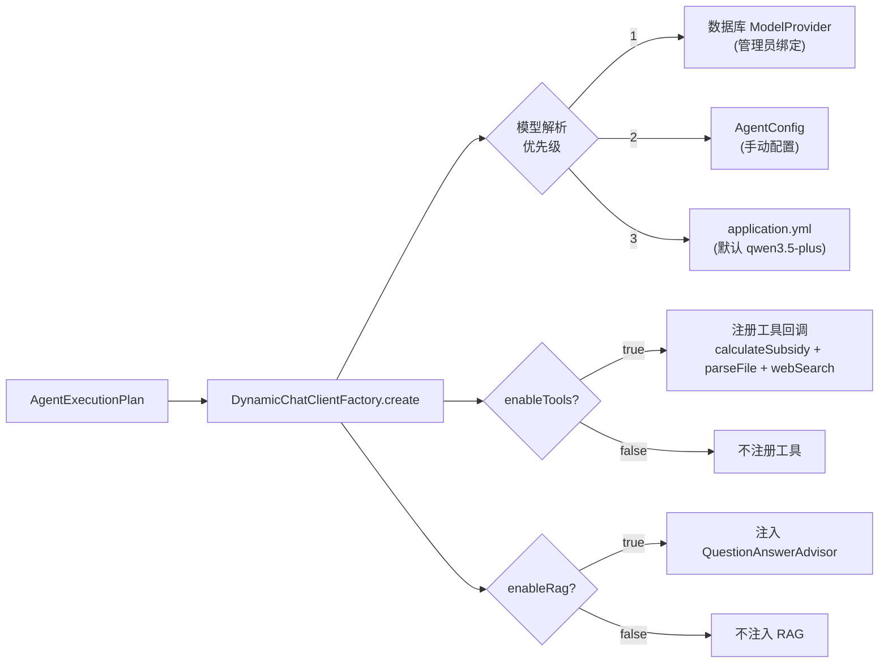

---

## 4. 记忆与多轮对话

### 4.1 三大子系统协同

多轮对话由三个子系统协同实现，各司其职：

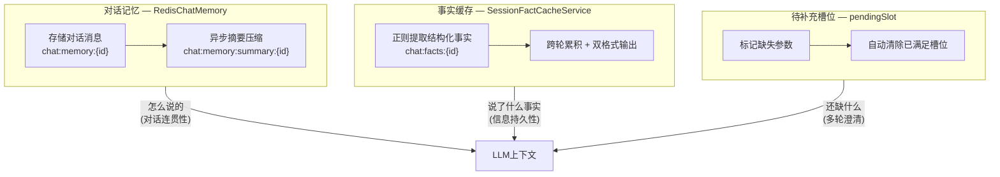

**核心设计思想**：对话记忆保证**对话连贯性**（LLM 看到最近对话），事实缓存保证**信息持久性**（关键事实不被摘要/截断丢失），槽位机制保证**信息完整性**（缺失参数自动追问）。三者互补。

### 4.2 对话记忆 — `RedisChatMemory`

#### 4.2.1 存储与淘汰

| 参数 | 配置值 | 说明 |
|---|---|---|
| `maxMessages` | 8 | 保留最近 8 条消息 |
| `maxMessageChars` | 1500 | 单条消息最大字符，超出截断并追加 `...[历史消息已截断]` |
| TTL | 7 天 | 滑动过期（每次写入刷新） |

#### 4.2.2 异步摘要压缩

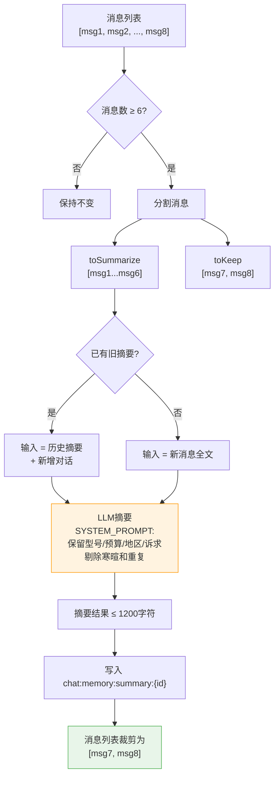

**摘要 SYSTEM_PROMPT**（第 38-44 行）：

```
你是对话记忆压缩助手。请把历史多轮对话压缩为简短摘要，要求：
1. 保留用户关键事实：设备型号、预算/价格、地区、诉求、约束条件。
2. 保留已确认结论，剔除寒暄和重复表述。
3. 不要编造不存在的信息。
4. 输出中文纯文本，最多 8 条，每条尽量简短。
```

**并发控制**：`ConcurrentHashMap<String, CompletableFuture<Void>>` 确保同一会话同一时间只有一个摘要任务运行。

#### 4.2.3 读取时合并

`get()` 方法返回时，先插入摘要作为 SystemMessage，再追加原始消息记录：

```
LLM 看到的上下文:
  [SystemMessage("【历史对话摘要】\n{摘要}")]
  [UserMessage(msg7)]
  [AssistantMessage(msg8)]
```

### 4.3 事实缓存 — `SessionFactCacheService`

#### 4.3.1 SessionFacts 数据结构

```java
SessionFacts {
    Set<String>  deviceModels;      // 设备型号: {"iPhone 16 Pro"}
    Set<String>  categories;        // 商品类别: {"手机"}
    Set<String>  regions;           // 地区线索: {"济南市"}
    Set<Integer> mentionedYears;    // 提及年份: {2025}
    Set<String>  intentHints;       // 意图线索: {"补贴测算", "政策咨询"}
    String       brand;             // 品牌: "苹果"
    String       series;            // 系列: "iPhone"
    String       model;             // 型号: "16 Pro"
    String       specification;     // 规格: "512GB"
    String       productType;       // 商品类型
    String       policyType;        // 政策类型
    Double       subsidyRate;       // 补贴比例
    Double       latestPrice;       // 最近金额: 8999.0
    Integer      latestPolicyYear;  // 最近政策年份
    String       cityCode;          // 城市编码: "370100"
    Double       latitude/longitude;// 地理坐标
    String       pendingSlot;       // 待补充: "购买价格"
    String       updatedAt;         // 更新时间
}
```

存储 key: `chat:facts:{conversationId}`，TTL: 7 天，滑动过期。

#### 4.3.2 事实提取策略

**按来源差异化提取**（`applyTextFacts`），避免 LLM 幻觉污染事实缓存：

| 来源 | 提取内容 | 不提取 |
|---|---|---|
| `USER_INPUT` | 价格、设备、年份、类别、地区、意图、品牌、型号、规格、政策类型、补贴比例 | — |
| `WEB_SEARCH` | 价格、设备、年份、类别、品牌、型号 | 地区、意图 |
| `ASSISTANT_RESPONSE` | 仅设备、品牌、型号 | 价格、类别、地区、意图 |

**提取方式**：纯正则匹配（8+ 个 Pattern），无 LLM 参与，零延迟开销：

| Pattern | 匹配目标 | 示例 |
|---|---|---|
| `PRICE_PATTERN` | 金额（排除补贴金额/政策年份） | `5999元`, `¥8999` |
| `REGION_PATTERN` | 省/市/区/县 | `济南市历下区` |
| `YEAR_PATTERN` | 2020-2099 年份 | `2025年` |
| `DEVICE_PATTERN` | 常见设备型号 | `iPhone 16 Pro`, `华为Mate 70` |
| `CATEGORY_PATTERN` | 商品类别 | `手机`, `空调`, `笔记本` |
| `BRAND_PATTERN` | 品牌 | `华为`, `苹果`, `小米` |
| `MODEL_PATTERN` | 型号关键词 | `Mate 70`, `16 Pro` |
| `SPEC_PATTERN` | 规格参数 | `512GB`, `1TB` |

#### 4.3.3 双格式输出

| 方法 | 格式 | 用途 | 面向 |
|---|---|---|---|
| `toPromptContext()` | 展开格式，换行分段 | 注入用户消息 | 执行 LLM |
| `toPlanningContext()` | 紧凑 `key=value \| key=value` | 注入规划上下文 | 规划 LLM（省 token） |

展开格式示例：
```
【会话事实缓存】
- 设备型号：iPhone 16 Pro
- 品牌：苹果
- 商品类别：手机
- 最近提及金额：8999.0元
- 地区线索：济南市
- 当前诉求：补贴测算、政策咨询
- 待补充信息：购买价格
```

紧凑格式示例：
```
年份=2025 | 品类=手机 | 品牌=苹果 | 价格=8999元 | 诉求=补贴测算
```

### 4.4 待补充槽位 — `pendingSlot` 机制

实现**槽位填充式的多轮澄清**，系统记住"还缺什么"并在后续轮次检查是否已满足：

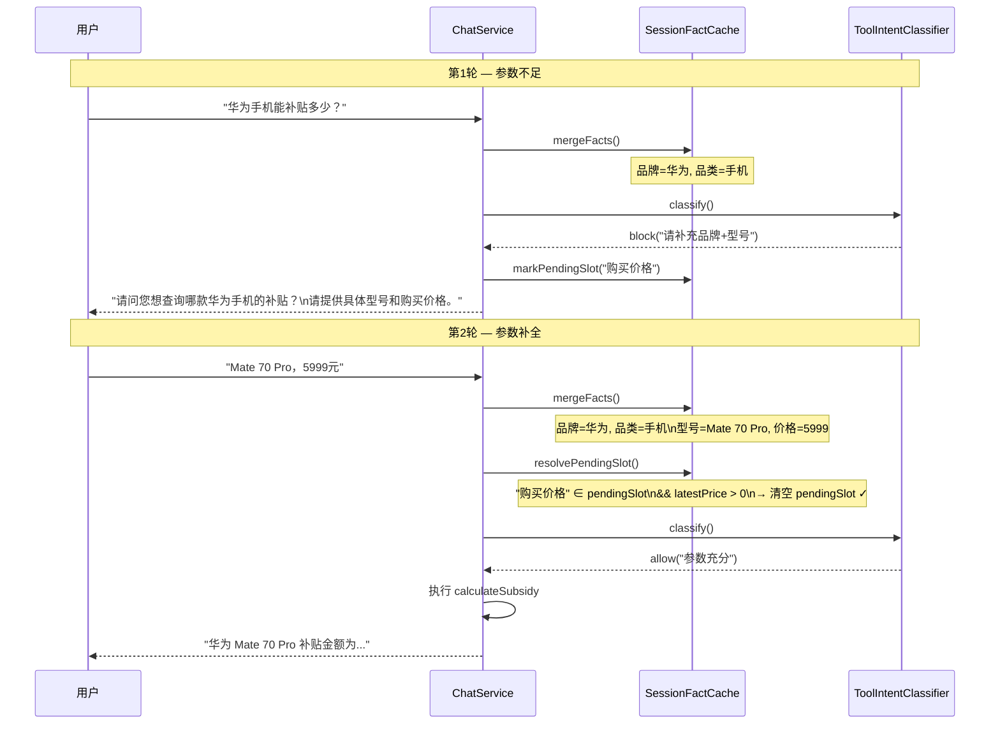

**resolvePendingSlot 自动清除逻辑**：

| pendingSlot 值 | 清除条件 |
|---|---|
| `"商品类别"` | `categories` 非空 |
| `"购买价格"` | `latestPrice > 0` |
| `"政策年份"` | `latestPolicyYear != null` |

### 4.5 多轮对话完整状态流转

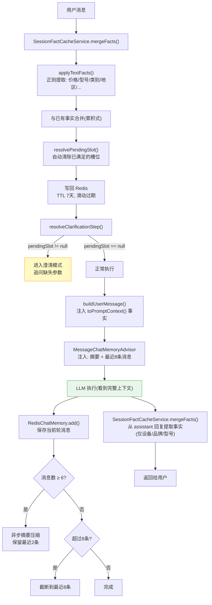

### 4.6 对话记忆 vs 事实缓存的分工

| 维度 | 对话记忆 (RedisChatMemory) | 事实缓存 (SessionFactCache) |
|---|---|---|
| **解决什么问题** | "怎么说的" — 对话连贯性 | "说了什么事实" — 信息持久性 |
| **存储内容** | 原始消息文本 + LLM 生成摘要 | 结构化字段（型号/价格/地区/...） |
| **提取方式** | LLM 摘要压缩 | 正则匹配，无 LLM 开销 |
| **信息衰减** | 消息被截断/摘要后细节丢失 | 关键事实永久保留直至会话过期 |
| **注入格式** | 历史消息（SystemMessage + UserMessage） | 结构化文本段落 |
| **TTL** | 7 天 | 7 天 |
| **并发安全** | ConcurrentHashMap 防重复摘要 | Redis 原子操作 |

---

## 5. 源码索引

### 缓存相关

| 组件 | 文件路径 |
|---|---|
| QA 语义缓存 | `service/QuestionSemanticCacheService.java` |
| 商品价格缓存 | `service/ProductPriceCacheService.java` |
| 会话事实缓存 | `service/SessionFactCacheService.java` |
| 联网搜索缓存 | `tool/WebSearchTool.java` (内嵌缓存逻辑) |
| 对话记忆 | `advisor/RedisChatMemory.java` |
| 会话管理 | `service/ConversationService.java` |
| Redis 配置 | `config/RedisConfig.java` |

### RAG 相关

| 组件 | 文件路径 |
|---|---|
| 文档加载 | `rag/DocumentLoaderService.java` |
| 遗留切片 | `rag/TextSplitterService.java` |
| 知识库服务 | `rag/KnowledgeService.java` |
| 嵌入服务 | `rag/EmbeddingService.java` |
| 嵌入配置 | `config/EmbeddingModelConfig.java` |
| 多向量存储 | `rag/MultiVectorStoreService.java` |
| 运行时向量存储 | `rag/RuntimeRagVectorStore.java` |
| RAG 检索 | `rag/RagRetrievalService.java` |
| DashScope 重排 | `rag/DashScopeRerankService.java` |
| 重排装饰器 | `rag/RerankingVectorStore.java` |
| 入库调度 | `rag/KnowledgeIngestScheduler.java` |
| 增量状态 | `rag/IngestionStateService.java` |
| 存储服务 | `rag/StorageService.java` |
| RAG 故障检测 | `rag/RagFailureDetector.java` |
| 知识库配置初始化 | `rag/KnowledgeConfigInitializer.java` |
| 嵌入模型迁移 | `rag/KnowledgeEmbeddingMigrationRunner.java` |
| 知识库控制器 | `controller/AdminKnowledgeController.java` |

### 上下文与记忆相关

| 组件 | 文件路径 |
|---|---|
| 对话编排(主流程) | `service/ChatService.java` |
| 安全 Advisor | `advisor/SecurityAdvisor.java` |
| ReReading Advisor | `advisor/ReReadingAdvisor.java` |
| 日志 Advisor | `advisor/LoggingAdvisor.java` |
| Advisor 链配置 | `config/ChatClientConfig.java` |
| 动态 ChatClient | `service/DynamicChatClientFactory.java` |
| 动态 Agent 配置 | `config/DynamicAgentConfigHolder.java` |
| ReAct 规划 | `agent/ReActPlanningService.java` |
| 工具意图分类 | `agent/ToolIntentClassifier.java` |
