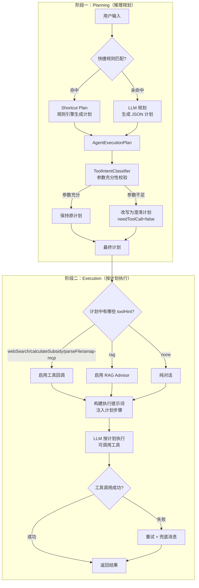
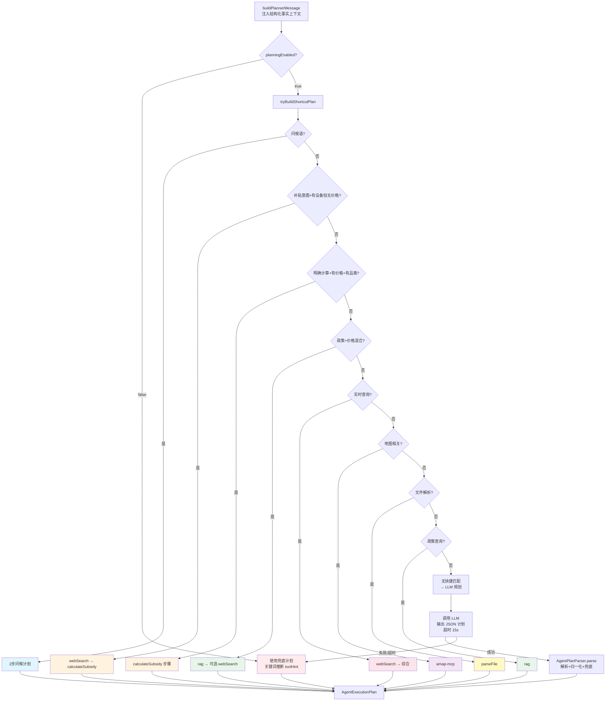
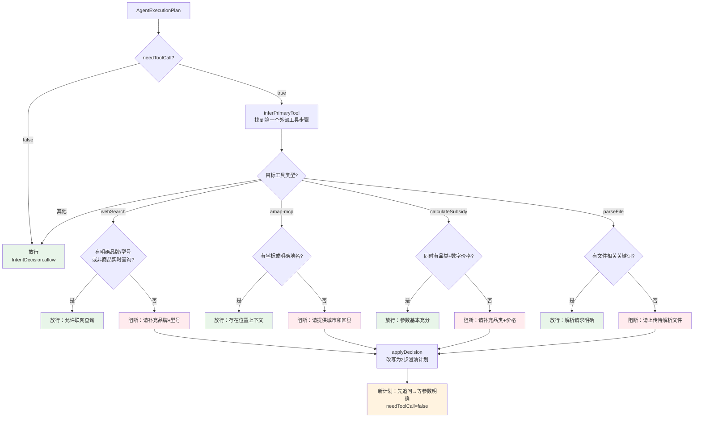
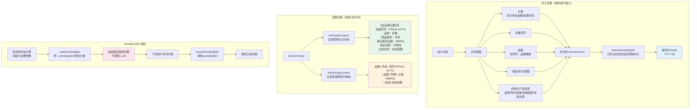
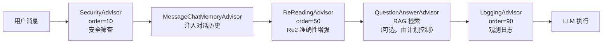

# ReAct 自主规划智能体设计笔记

## 1. 设计哲学

本项目采用 **Plan-then-Execute（先规划后执行）** 的 ReAct 变体模式，而非传统的 Thought→Action→Observation 循环迭代。

核心思路：将"推理"和"执行"拆分为两个独立阶段——先用 LLM 或规则引擎生成结构化执行计划，再由 LLM 按计划单次执行并调用工具。这样做的优势：

- **减少无效工具调用**：规划阶段即可拦截参数不足的工具调用
- **可观测性**：计划是结构化的 JSON，可记录、审计、人工干预
- **性能优化**：根据计划动态启闭工具/RAG，避免不必要的开销
- **快捷路径**：高频模式可直接走规则，省掉 LLM 规划调用

---

## 2. 全局执行流程

```
用户输入 (ChatRequest)
  │
  ├─ 1. 合并会话事实 ──── SessionFactCacheService.mergeFacts()
  ├─ 2. 丰富事实（商品价格缓存）── ProductPriceCacheService
  ├─ 3. 缓存本轮价格
  ├─ 4. 检查澄清步骤 ──── pendingSlot / 缺参 → 直接返回澄清问题
  ├─ 5. 快速路径 ──────── FastPathService.tryDirectAnswer() → 规则直答
  ├─ 6. QA 语义缓存 ──── QuestionSemanticCacheService.lookup()
  ├─ 7. 价格预取（纯价格查询时）── ProductPriceCacheService.prefetchPriceAsync()
  ├─ 8. 等待预取价格（≤6s 轮询）
  ├─ 9. 构建规划器消息 ── buildPlannerMessage()
  ├─ 10. 创建 ReAct 计划 ── ReActPlanningService.createPlan()
  ├─ 11. 工具意图校验 ──── ToolIntentClassifier.classify()
  ├─ 12. 强制实时搜索 ──── enforceRealtimeWebSearch()
  ├─ 13. 构建执行提示词 ── buildExecutionPrompt()
  ├─ 14. 动态 ChatClient ── DynamicChatClientFactory.create(enableTools, enableRag)
  ├─ 15. 执行对话 ──────── executeChatWithFallback()（含多级降级链）
  ├─ 16. 确保非空响应
  ├─ 17. 保存 QA 语义缓存
  └─ 18. 返回 ChatResponse
```

---

## 3. 核心流程图

### 3.1 两阶段 ReAct 总览



### 3.2 规划阶段详细流程



### 3.3 工具意图校验流程



### 3.4 执行阶段与降级链

```mermaid
flowchart TD
    A[构建执行提示词<br/>含计划步骤] --> B{plan.needToolCall?}
    B -- 是 --> C[非流式执行<br/>规避流式工具调用缺陷]
    B -- 否 --> D[流式执行]

    D --> E{工具调用错误?}
    E -- 是 --> F[降级为非流式调用]
    E -- 否 --> G{RAG 检索失败?}
    G -- 是 --> H[降级为无 RAG 非流式调用]
    G -- 否 --> I[正常返回]

    C --> J{执行成功?}
    F --> J
    H --> J
    J -- 成功 --> K[返回结果]
    J -- 超时/网络错误 --> L[直连 API 调用<br/>modelProviderService<br/>.executeChatCompletion]
    L -- 成功 --> K
    L -- 失败 --> M[友好错误提示<br/>"当前模型服务响应超时"]

    K --> N[ensureNonBlankResponse]
    N --> O[最终 ChatResponse]

    style I fill:#e8f5e9
    style K fill:#e8f5e9
    style O fill:#e8f5e9
    style F fill:#fff3e0
    style H fill:#fff3e0
    style L fill:#fce4ec
    style M fill:#ffebee
```

### 3.5 会话事实缓存流程



---

## 4. 核心数据结构

### 4.1 AgentExecutionPlan — 执行计划

```java
// agent/AgentExecutionPlan.java
public record AgentExecutionPlan(
    String summary,        // 一句话计划描述
    boolean needToolCall,  // 是否需要外部工具
    List<AgentStep> steps  // 有序步骤列表
) {
    public record AgentStep(
        int id,
        String action,     // 步骤描述（给 LLM 看的指令文本）
        String toolHint    // 工具提示：none | rag | calculateSubsidy | parseFile | webSearch | amap-mcp
    ) {}
}
```

**toolHint 是控制面字段**——不直接传给 LLM，而是控制运行时哪些工具回调和 RAG Advisor 被激活。

### 4.2 SessionFacts — 会话事实

```java
// service/SessionFactCacheService.java
public static class SessionFacts {
    Set<String> deviceModels;     // "iPhone 16 Pro"
    Set<String> categories;       // "手机", "平板"
    Set<String> regions;          // "济南市"
    Set<Integer> mentionedYears;  // 2025, 2026
    Set<String> intentHints;      // "政策咨询", "补贴测算", "价格查询"
    String brand;                 // "苹果"
    String series;                // "Pro"
    String model;                 // 型号明细
    String specification;         // "256GB"
    String productType;           // "手机"
    Integer productYear;
    String policyType;            // "国补"
    Double subsidyRate;           // 15.0
    Double latestPrice;           // 8999.0
    Integer latestPolicyYear;
    String cityCode;
    Double latitude, longitude;
    String pendingSlot;           // "购买价格" — 缺什么等什么
    String updatedAt;
}
```

### 4.3 IntentDecision — 意图校验结果

```java
// agent/ToolIntentClassifier.java
public record IntentDecision(
    boolean allowToolCall,        // true=放行, false=阻断
    String targetTool,            // 被校验的工具名
    String clarificationQuestion, // 阻断时的澄清问题
    String reason                 // 阻断/放行原因
)
```

---

## 5. 核心组件详解

### 5.1 ReActPlanningService — 规划服务

**文件**：`agent/ReActPlanningService.java`

| 路径 | 触发条件 | 生成计划 | needToolCall |
|------|----------|----------|-------------|
| 问候 | "你好"/"hello" 等 | 2步问候计划 | false |
| 先查价再补贴 | 补贴意图+有设备+无价格 | webSearch → calculateSubsidy → 提示确认 | true |
| 补贴计算 | 明确计算意图+有价格+有品类 | 校验参数 → calculateSubsidy | true |
| 政策+价格混合 | 政策关键词+价格关键词 | rag → 可选补充价格 | false |
| 实时查询 | "最新/实时/价格/新闻" | webSearch → 综合 | true |
| 地图检索 | "地图/导航/门店/附近" | amap-mcp 步骤 | true |
| 文件解析 | "发票/附件/上传" | parseFile 步骤 | true |
| 政策查询 | "政策/申请/流程/条件" | rag → 整理回答 | false |
| LLM 规划 | 以上均不匹配 | LLM 生成 JSON 计划（超时15s） | 由 LLM 决定 |
| 兜底计划 | LLM 规划失败 | 关键词推断 toolHint → 2步计划 | 由推断决定 |

**规划器 System Prompt 核心指令**：
- 步骤数≤4，按执行顺序排列
- 门店/路线 → amap-mcp
- 补贴计算 → calculateSubsidy
- 政策依据 → rag
- 实时信息 → webSearch
- 政策+价格混合 → 先 rag 后 webSearch

### 5.2 AgentPlanParser — 计划解析器

**文件**：`agent/AgentPlanParser.java`

解析 LLM JSON 输出的防御链：

1. **剥离代码围栏** — 去除 `` ```json ... ``` ``
2. **JSON 解析** — Jackson 解析 summary/steps/needToolCall
3. **toolHint 归一化** — 校验白名单，非法值从 action 文本重新推断
4. **needToolCall 三层推断** — (a) 任意步骤含外部工具 → true；(b) 用户消息关键词推断；(c) 模型布尔标记 + 关键词
5. **兜底计划** — 解析异常时生成基于关键词的 2 步计划

关键词→工具推断规则：

| 关键词 | toolHint |
|--------|----------|
| 地图/导航/路线/附近/高德 | amap-mcp |
| 补贴/计算/到手价 | calculateSubsidy |
| 发票/文件/解析 | parseFile |
| 联网/搜索/实时/最新/价格/新闻 | webSearch |
| 政策/依据/文档/检索 | rag |
| 其他 | none |

### 5.3 ToolIntentClassifier — 工具意图校验器

**文件**：`agent/ToolIntentClassifier.java`

执行前的"守门器"，验证计划中的工具调用是否具备充分参数：

| 工具 | 允许条件 | 阻断澄清 |
|------|----------|----------|
| webSearch | 有明确品牌/型号，或非商品类实时查询 | "请补充品牌+型号" |
| amap-mcp | 有坐标或明确地名（省/市/区/路） | "请提供城市和区县" |
| calculateSubsidy | 同时有品类+数字价格 | "请补充明确商品类型+数字价格" |
| parseFile | 有文件相关关键词 | "请上传待解析文件" |

**阻断时行为**：`applyDecision()` 将原计划改写为 2 步澄清计划，`needToolCall=false`。

### 5.4 SessionFactCacheService — 会话事实缓存

**文件**：`service/SessionFactCacheService.java`

**核心能力**：从非结构化对话中结构化提取关键事实，持久化到 Redis，供多轮对话复用。

提取管线（`applyTextFacts`）：

| 事实类型 | 提取方法 | 来源 | 备注 |
|----------|----------|------|------|
| 价格 | `extractPrice` | 用户输入/联网搜索 | 区分补贴金额和政策年份 |
| 设备型号 | `extractDeviceModels` | 用户输入/助手回复 | iPhone/华为/小米等 |
| 品类 | `extractCategories` | 用户输入 | 含型号→品类推断 |
| 地区 | `extractRegions` | 用户输入 | X省/X市/X区 |
| 年份 | `extractYears` | 用户输入 | 2020-2099 |
| 意图线索 | `extractIntentHints` | 用户输入 | 政策咨询/补贴测算/价格查询 |
| 结构化产品 | `extractStructuredProductFacts` | 用户输入/助手回复 | 品牌/型号/规格/政策类型/补贴比例 |

**两种消费方式**：
- `toPromptContext()` → 结构化文本块，注入用户消息给执行 LLM
- `toPlanningContext()` → 紧凑管道分隔串，注入规划器消息

**Pending Slot 机制**：标记缺失参数（如"购买价格"），下轮自动检查是否已补全。

### 5.5 ToolFailurePolicyCenter — 工具失败策略中心

**文件**：`tool/ToolFailurePolicyCenter.java`

| 策略 | 实现 |
|------|------|
| 指数退避重试 | 最多2次，间隔300ms，仅对超时/502/503/连接错误重试 |
| 工具级兜底 | webSearch: "先基于已知政策给出参考结论"；calculateSubsidy: "按规则手动估算"；amap-mcp: "请提供更具体区县" |

### 5.6 DynamicChatClientFactory — 动态 ChatClient 工厂

**文件**：`service/DynamicChatClientFactory.java`

**模型解析优先级**：
1. 管理员已配置模型（`ModelProvider` 实体，数据库驱动）
2. 手工配置（`AgentConfig` 的 apiUrl/apiKey/modelName）
3. 默认配置（application.yml，qwen3.5-plus）

**动态能力控制**：
- `enableTools=false` → 不注册 ToolCallbackProvider
- `enableRag=false` → 不注入 QuestionAnswerAdvisor
- 由计划的 toolHint 值决定运行时配置

---

## 6. Advisor 链



| Advisor | 顺序 | 职责 | 关键行为 |
|---------|------|------|----------|
| SecurityAdvisor | 10 | 输入安全筛查 | 敏感词 + 提示注入模式匹配 |
| MessageChatMemoryAdvisor | - | 注入对话历史 | Redis 存储，≤8条，超6条触发异步摘要 |
| ReReadingAdvisor | 50 | Re2 准确性增强 | 复述问题 + 校验指令 + 尾部再复述 |
| QuestionAnswerAdvisor | - | RAG 检索 | 向量搜索 topK + 相似度阈值 |
| LoggingAdvisor | 90 | 观测日志 | token 用量、检索文档、耗时 |

### RedisChatMemory 摘要机制

```
对话历史（>6条）
  │
  ├── 保留最近2条原样
  ├── 旧消息 → LLM 异步摘要为 SystemMessage
  │     保留：设备型号、预算/价格、地区、用户诉求、约束
  │     去除：问候语、重复内容
  └── 摘要超时8s，失败则保留原始消息
```

---

## 7. 执行提示词结构

```
【用户原始问题】
<用户消息 + 会话事实上下文 + 城市/定位上下文>

【ReAct执行计划（由系统规划）】
目标：<plan.summary>
需要工具：<plan.needToolCall>
步骤：
1. <step.action> [toolHint=<step.toolHint>]
2. <step.action> [toolHint=<step.toolHint>]
...

【执行要求】
1. 严格按计划执行，信息不足可先提最少必要问题
2. 需要事实依据时优先使用 RAG 检索结果
3. 需要计算补贴时必须调用 calculateSubsidy
4. 门店/路线优先调用高德地图 MCP
5. 不要暴露内部思维链路
6. 政策+价格混合诉求先政策后价格
7. 强时效诉求应调用 webSearch 并附来源链接

【混合问法补充策略】（仅政策+价格混合时追加）
1. 先输出山东本地政策口径与适用边界
2. 暂缺实时价格不要编造，引导用户补充
3. 价格补充放在政策结论之后
```

---

## 8. 多级降级链

```mermaid
flowchart TD
    A[流式执行] --> B{工具调用错误?}
    B -- 是 --> C[降级：非流式调用]
    B -- 否 --> D{RAG 检索失败?}
    D -- 是 --> E[降级：无 RAG 非流式调用]
    D -- 否 --> F[正常返回 ✓]

    C --> G{执行成功?}
    E --> G
    G -- 成功 --> F
    G -- 超时/网络错误 --> H[降级：直连 API<br/>modelProviderService<br/>.executeChatCompletion]
    H -- 成功 --> F
    H -- 失败 --> I[友好错误提示<br/>"当前模型服务响应超时"]

    style F fill:#e8f5e9
    style I fill:#ffebee
```

---

## 9. 设计模式总结

| 模式 | 体现 | 优势 |
|------|------|------|
| **Plan-then-Execute** | 先生成结构化计划，再按计划执行 | 计划可审计/干预，减少盲目工具调用 |
| **多层防御** | 快捷规则 → LLM → 关键词兜底 → 意图校验 → pendingSlot → 管理员开关 → 重试兜底 | 每层拦截不同类型的无效调用 |
| **动态能力启闭** | toolHint 控制运行时工具/RAG 注入 | 减少干扰，节省 token 和延迟 |
| **会话事实累积** | 正则提取 → Redis 持久化 → 规划+执行注入 | 多轮参数跨轮复用，避免重复追问 |
| **Advisor 中间件链** | 安全/记忆/准确性/检索/观测各自独立可插拔 | 横切关注点解耦，易于扩展 |
| **数据库驱动配置** | 系统提示词/模型/温度/工具启停存库 | 管理员热更新，无需重启 |
| **渐进降级** | 流式→非流式→无RAG→直连API→友好错误 | 最大化服务可用性 |

---

## 10. 关键源码索引

| 组件 | 文件路径 |
|------|----------|
| 执行计划数据结构 | `agent/AgentExecutionPlan.java` |
| 规划服务 | `agent/ReActPlanningService.java` |
| 计划解析器 | `agent/AgentPlanParser.java` |
| 工具意图校验 | `agent/ToolIntentClassifier.java` |
| 主编排服务 | `service/ChatService.java` |
| 会话事实缓存 | `service/SessionFactCacheService.java` |
| 工具失败策略 | `tool/ToolFailurePolicyCenter.java` |
| 动态 ChatClient 工厂 | `service/DynamicChatClientFactory.java` |
| 快速路径 | `service/FastPathService.java` |
| 商品价格缓存 | `service/ProductPriceCacheService.java` |
| QA 语义缓存 | `service/QuestionSemanticCacheService.java` |
| Advisor 配置 | `config/ChatClientConfig.java` |
| 安全 Advisor | `advisor/SecurityAdvisor.java` |
| Re2 Advisor | `advisor/ReReadingAdvisor.java` |
| 日志 Advisor | `advisor/LoggingAdvisor.java` |
| Redis 对话记忆 | `advisor/RedisChatMemory.java` |
