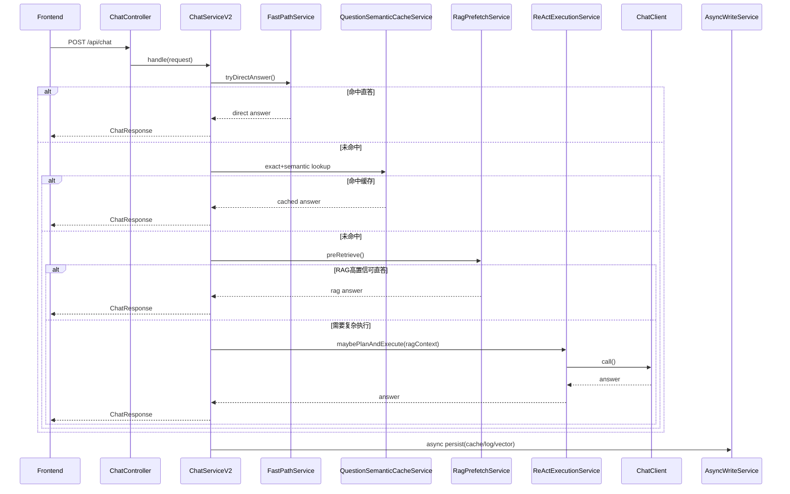

# ReAct 智能体性能重构设计（智能问答模块）

## 文档信息

| 项目 | 内容 |
|------|------|
| 文档名称 | ReAct 智能体性能重构设计（智能问答模块） |
| 创建日期 | 2026-03-30 |
| 版本 | v1.0 |
| 状态 | 草案 |
| 目标模块 | 智能问答（Chat/ReAct/RAG/WebSearch） |

---

## 1. 背景与目标

当前“智能问答”链路存在明显首包延迟和长尾超时问题，核心诉求如下：

1. 先查库再 ReAct，简单问题优先直接回复，减少无意义规划。
2. Redis 增加“问题哈希 + 原问题 + 语义向量”缓存，重复/近似问题直接命中。
3. 取消所有流式输出，统一非流式响应。
4. 涉及写数据库的操作改为异步，避免阻塞主回复链路。
5. 优化 webSearch 整体性能。

本设计在不更换技术栈前提下，使用现有 Spring Boot + Spring AI + Redis + PostgreSQL(pgvector) + React/Vite 进行重构。

---

## 2. 现状组件分析（基于代码）

### 2.1 入口层

1. [backend/src/main/java/com/shandong/policyagent/controller/ChatController.java](backend/src/main/java/com/shandong/policyagent/controller/ChatController.java)
: 提供 /api/chat（非流式）与 /api/chat/stream（SSE 流式）双通道。
2. [frontend/src/components/ChatWindow.jsx](frontend/src/components/ChatWindow.jsx)
: 当前默认走流式读取、SSE 分片解析、超时控制、状态动画。
3. [frontend/src/services/api.js](frontend/src/services/api.js)
: 提供 createStreamRequest，前端主链路依赖流式接口。

### 2.2 编排层（ChatService）

1. [backend/src/main/java/com/shandong/policyagent/service/ChatService.java](backend/src/main/java/com/shandong/policyagent/service/ChatService.java)
: 当前执行顺序是“先 ReAct 规划 + 意图分类 + 可能直连工具 + 最终模型调用”。
2. RAG 仅在计划包含 rag 且 webSearch 未命中时启用（shouldEnableRag）。
3. 流式模式对工具调用存在已知缺陷，代码中已有“检测到工具计划时直接降级非流式”的绕行逻辑，说明流式链路本身带来额外复杂度和开销。

### 2.3 ReAct/工具层

1. [backend/src/main/java/com/shandong/policyagent/agent/ReActPlanningService.java](backend/src/main/java/com/shandong/policyagent/agent/ReActPlanningService.java)
: 规划器支持快捷路径，但复杂请求仍可能触发模型规划。
2. [backend/src/main/java/com/shandong/policyagent/agent/ToolIntentClassifier.java](backend/src/main/java/com/shandong/policyagent/agent/ToolIntentClassifier.java)
: 工具调用前校验参数，避免无效调用。
3. [backend/src/main/java/com/shandong/policyagent/tool/WebSearchTool.java](backend/src/main/java/com/shandong/policyagent/tool/WebSearchTool.java)
: 具备 Redis 缓存 + 重试 + 过期策略，但 API 调用与向量缓存写入在主链路同步完成。

### 2.4 缓存与记忆层

1. [backend/src/main/java/com/shandong/policyagent/service/SessionFactCacheService.java](backend/src/main/java/com/shandong/policyagent/service/SessionFactCacheService.java)
: 当前仅缓存“会话事实（价格/品类/地区/型号）”，不缓存“问题-答案语义对”。
2. [backend/src/main/java/com/shandong/policyagent/advisor/RedisChatMemory.java](backend/src/main/java/com/shandong/policyagent/advisor/RedisChatMemory.java)
: 仅用于多轮消息记忆，不具备语义问答缓存能力。

### 2.5 RAG 层

1. [backend/src/main/java/com/shandong/policyagent/config/ChatClientConfig.java](backend/src/main/java/com/shandong/policyagent/config/ChatClientConfig.java)
: QuestionAnswerAdvisor 作为通用 Advisor 装配。
2. [backend/src/main/java/com/shandong/policyagent/rag/RagConfig.java](backend/src/main/java/com/shandong/policyagent/rag/RagConfig.java)
: 当前检索默认 topK=5、candidateTopK=20、rerankEnabled=true，长尾下成本较高。
3. [backend/src/main/java/com/shandong/policyagent/rag/DashScopeRerankService.java](backend/src/main/java/com/shandong/policyagent/rag/DashScopeRerankService.java)
: Rerank 为额外网络调用，属于高时延点。

---

## 3. 核心问题归因

1. ReAct 启动时机过早：在任何缓存命中和检索前先规划，导致简单问题也进入高成本路径。
2. 问答缓存粒度不足：Redis 里没有“问题哈希 + 语义向量 + 标准答案”的命中层。
3. 流式链路冗余：前后端都维护流式分片解析、超时、降级逻辑，复杂度高且收益有限。
4. 写操作阻塞：webSearch 的向量缓存写入在主线程执行。
5. webSearch 未做单飞与分级回退：相同查询并发时重复打上游，且过期重查与返回策略未彻底解耦。

---

## 4. 重构目标与指标

### 4.1 目标

1. 构建“快路径优先”的四段式问答流水线：快速直答 -> Redis 语义缓存 -> RAG 预检索 -> ReAct 按需执行。
2. 全面切换为非流式输出。
3. 所有非关键写操作异步化。
4. webSearch 增加并发去重与异步缓存落盘。

### 4.2 建议验收指标（生产灰度后）

1. 首字节时延（TTFB）P50：下降 35% 以上。
2. 完整响应时延 P95：下降 30% 以上。
3. ReAct 规划触发率：降低到 40% 以下（视业务复杂度调整）。
4. Redis 问答缓存命中率：稳定在 25% 以上（高频问题场景）。
5. webSearch 上游请求量：同周期下降 20% 以上（得益于缓存 + 单飞）。

---

## 5. 目标架构

### 5.1 新的请求处理顺序

1. Fast Path（规则直答）
: 问候、纯补贴计算（参数齐全）、固定模板类问题直接回答。
2. Redis Q/A 语义缓存
: 先精确 hash 命中，再语义近邻命中。
3. RAG 预检索
: 命中高置信文档时直接生成答案或作为上下文。
4. ReAct 按需执行
: 仅复杂任务（多步骤、工具编排、实时数据依赖）进入规划。
5. 统一非流式返回
: 直接返回 ChatResponse。

### 5.2 时序图



---

## 6. 详细设计

### 6.1 ChatService 重构（核心）

将 [backend/src/main/java/com/shandong/policyagent/service/ChatService.java](backend/src/main/java/com/shandong/policyagent/service/ChatService.java) 从“单体编排”拆为“分层编排”：

1. 新增 ChatOrchestrator（或 ChatServiceV2）
: 只负责阶段调度与降级。
2. 新增 FastPathService
: 迁移现有快捷路径中的纯规则能力。
3. 新增 QuestionSemanticCacheService
: 负责问题缓存的存取与语义匹配。
4. 新增 RagPrefetchService
: 在 ReAct 前执行预检索并返回置信度。
5. 新增 ReActExecutionService
: 封装 planning + tool intent + tool callback 的复杂路径。

建议入口伪代码：

```java
ChatResponse handle(ChatRequest req) {
    Context ctx = contextAssembler.build(req);

    DirectAnswer direct = fastPathService.tryAnswer(ctx);
    if (direct.hit()) return direct.toResponse();

    CacheAnswer cached = qaCacheService.lookup(ctx);
    if (cached.hit()) return cached.toResponse();

    RagPrefetchResult rag = ragPrefetchService.retrieve(ctx);
    if (rag.canAnswerDirectly()) return rag.toResponse();

    ChatResponse resp = reactExecutionService.execute(ctx, rag);
    asyncWriteService.persistAfterResponse(ctx, resp, rag);
    return resp;
}
```

### 6.2 Redis 问答语义缓存设计（满足“问题哈希+问题+语义向量”）

#### 6.2.1 数据结构

1. Key: qa:q:hash:{sha256(normalizedQuestion)}
: Value(JSON):
- questionHash
- rawQuestion
- normalizedQuestion
- embeddingModelId
- embeddingVector（压缩存储，建议 float[] -> byte[] -> Base64）
- answer
- references
- toolUsed
- createdAt/updatedAt
- hitCount

2. Key: qa:q:bucket:{simhashPrefix}
: Value(Set)
- member 为 questionHash，用于语义近邻候选集裁剪。

3. Key: qa:q:meta:{questionHash}
: Value(Hash)
- 保存轻量索引字段（updatedAt/hitCount/ttl）用于淘汰策略。

#### 6.2.2 查询流程

1. 精确命中
: 使用 normalizedQuestion 做 sha256，直接查 hash key。
2. 语义命中
: 计算当前问题 embedding + simhashPrefix，取 bucket 内候选；在应用层计算余弦相似度，阈值建议 0.90。
3. 命中策略
: 若相似度 >= 阈值且缓存答案未过期，直接返回。

#### 6.2.3 写入策略

1. 仅在以下条件写入
- 最终答案非空。
- 非错误兜底回答。
- 非强时效问题（例如“最新价格”可以短 TTL 单独缓存）。
2. 默认 TTL
- 普通政策问答：24h。
- 实时价格类：15~30min。

#### 6.2.4 向量来源

复用 [backend/src/main/java/com/shandong/policyagent/rag/EmbeddingService.java](backend/src/main/java/com/shandong/policyagent/rag/EmbeddingService.java) 的 embedTexts，避免引入新依赖。

### 6.3 “先查库再 ReAct”策略

1. RAG 预检索前置
: 在是否进入 ReAct 之前先调用 RagPrefetchService，得到 TopK 文档、最高分、命中文档类型。
2. 直答判定
: 若属于政策解释类问题且检索置信度高（例如 top1 score >= 0.86），直接非 ReAct 回答。
3. 注入 ReAct
: 仅当以下条件之一成立时进入 ReAct：
- 需要工具调用（webSearch / calculateSubsidy / parseFile / amap-mcp）。
- 问题为多步骤复合意图。
- RAG 结果冲突或置信度不足。

### 6.4 取消流式输出（前后端统一）

#### 6.4.1 后端

1. 保留并增强 /api/chat。
2. /api/chat/stream 分两阶段处理：
- 阶段A（兼容期）：返回 410 + 明确提示客户端升级。
- 阶段B（清理期）：删除 chatStream 相关实现与模型 ChatStreamEvent。
3. 清理 [backend/src/main/java/com/shandong/policyagent/service/ChatService.java](backend/src/main/java/com/shandong/policyagent/service/ChatService.java) 中流式降级逻辑与 SSE 异常分支。

#### 6.4.2 前端

1. 将 [frontend/src/components/ChatWindow.jsx](frontend/src/components/ChatWindow.jsx) 从 createStreamRequest 改为 sendMessage。
2. 删除 SSE chunk 解析、stream timeout、transient streaming 状态逻辑。
3. 保留“处理中”loading 态，但以一次性响应更新消息。

### 6.5 异步写数据库/存储操作

#### 6.5.1 适用场景

1. webSearch 结果写向量库。
2. 问答缓存回写（Redis 写入可异步批量化）。
3. 未来新增“价格历史表”或“问答追踪表”的写入。

#### 6.5.2 执行方式

1. 新增 ChatAsyncConfig（ThreadPoolTaskExecutor，独立线程池）。
2. 新增 AsyncWriteService，统一提交 Runnable/CompletableFuture。
3. 主链路只等待“对用户可见的必要数据”，不等待写入任务完成。

#### 6.5.3 失败处理

1. 异步写失败仅记录日志 + 计数器，不影响用户响应。
2. 可选：重试 1~2 次（指数退避），避免短暂抖动丢失。

### 6.6 WebSearch 性能优化

针对 [backend/src/main/java/com/shandong/policyagent/tool/WebSearchTool.java](backend/src/main/java/com/shandong/policyagent/tool/WebSearchTool.java)：

1. 单飞机制（SingleFlight）
: 相同 query 在同一时刻仅允许一个上游请求，其余请求等待已有 Future。
2. 过期缓存后台刷新
: 先返回 stale，再后台 revalidate，避免前台阻塞。
3. 向量缓存异步化
: cacheSearchResultToVectorStore 改为异步提交。
4. 动态结果数
: maxResults 按问题类型动态调整（价格类 3 条，政策类 5 条）。
5. 查询归一化
: 去除上下文噪音（城市坐标、冗余提示词）后再检索，提升缓存命中率。
6. 更细粒度超时
: 区分连接超时与读取超时，避免单一 timeout 导致不稳定。

---

## 7. 关键配置项设计

建议新增配置：

```yaml
app:
  chat:
    mode: sync-only # sync-only | dual
  agent:
    fast-path-enabled: true
    pre-rag-enabled: true
    react-complexity-threshold: 0.65
  qa-cache:
    enabled: true
    ttl-minutes: 1440
    semantic-threshold: 0.90
    bucket-prefix-bits: 14
  websearch:
    singleflight-enabled: true
    async-vector-cache: true
    stale-while-revalidate: true
```

说明：配置默认值应保持“兼容现有行为优先”。

---

## 8. 分阶段实施计划

### Phase 1：可观测性与安全改造（1-2天）

1. 增加链路分段耗时日志（fast-path/cache/rag/react/tool/model）。
2. 加入核心指标埋点（缓存命中率、ReAct触发率、webSearch外部调用率）。

### Phase 2：语义缓存与前置检索（3-5天）

1. 实现 QuestionSemanticCacheService。
2. 实现 RagPrefetchService。
3. 改造 ChatService 主流程为“先快后慢”。

### Phase 3：去流式与前端收敛（2-3天）

1. 前端改为统一调用 /api/chat。
2. 后端 stream 接口进入兼容期并下线。

### Phase 4：异步写与 webSearch 提速（2-4天）

1. 单飞 + 异步向量缓存 + stale 刷新。
2. 线程池、重试和降级策略联调。

### Phase 5：灰度与回归（2-3天）

1. A/B 比较旧链路与新链路时延。
2. 灰度发布后逐步全量。

---

## 9. 测试与验收方案

### 9.1 单元测试

1. 问候/简单问题必须绕过 ReAct。
2. 精确 hash 命中与语义命中正确性。
3. RAG 置信度分支：直答 vs 进入 ReAct。
4. webSearch 单飞去重与过期缓存回退。

### 9.2 集成测试

1. /api/chat 正常响应与引用回传。
2. 非流式模式下的异常链路（上游超时、RAG失败、工具失败）。
3. 异步写失败不影响主响应。

### 9.3 性能测试

1. 典型场景并发压测（20/50/100 并发）。
2. 指标采集：P50/P95、超时率、CPU、Redis QPS、外部 webSearch QPS。

---

## 10. 风险与回滚

### 10.1 风险

1. 语义缓存误命中导致答非所问。
2. 过期缓存返回旧价格信息。
3. 过度降低 ReAct 触发率导致复杂任务质量下降。

### 10.2 缓解

1. 增加命中阈值与关键词黑名单（时效词强制 bypass 缓存）。
2. 价格类短 TTL + 返回“数据时间戳”。
3. 保留开关：可快速切回“强制 ReAct”模式。

### 10.3 回滚策略

1. 配置级回滚（关闭 fast-path/pre-rag/qa-cache/singleflight）。
2. 保留旧 ChatService 分支一版发布周期，必要时灰度切回。

---

## 11. 结论

该方案在不改技术栈前提下，核心通过“执行顺序重排 + 语义缓存 + 非流式收敛 + 异步写 + webSearch 单飞化”达成提速目标。其关键不是单点优化，而是将当前串行高成本链路改造成分层命中式流水线，让大多数简单请求在 ReAct 之前结束，复杂请求再进入智能体编排。
